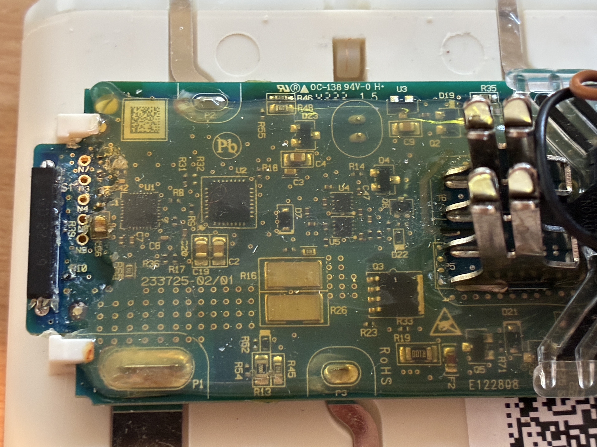

# # Boost | Eco permanent version (4.15V | 4.00V)
### An (Unofficial) Firmware Upgrade for Dyson V6/V7 & V8 Vacuum Battery Management System (BMS)

------
This is a fork of the [FW-Dyson-BMS](https://github.com/tinfever/FW-Dyson-BMS) and V8 support from [bluespresso](https://github.com/tinfever/FW-Dyson-BMS/issues/76). I have made an additional improvements and fixes.

**🔋 Compatible Models V6/V7:** SV03, SV04, SV05, SV06, SV09, HH11

**🔋 Compatible Models V8:** SV10, SV25, [SV37](https://github.com/tinfever/FW-Dyson-BMS/issues/80)

## Revolutionary features:
- 	**Persistent Mode:** Boost (4,15V) and Eco (4,00V) modes persist across power cycles, stored in memory with visual identification of selected mode. Boost mode is a standard version, Eco mode if always-on-the-charger scenario.
-	Resolved the excessive draw on cell 1 when left on charger. If left on charger only the PIC is put to sleep after full charge. Result is an even current draw on all cells, approx 1,2mA. The ISL and the PIC will fully go to sleep if not left on the charger, drawing less than 3µA on cell 1 and less than 1µA on the other cells. Previously when left on the charger the ISL and PIC would go to sleep while wake up signal would be high on the ISL. Cell 1 would draw about 400µA more than the other cells which would lead to an imbalance over time.
-	Cell voltage offsets in eeprom to account for inaccurate internal voltage measurement of the ISL (separate instruction for this in Documents folder)
-	Determine and factor in internal resistance of the cells to better utilise high currents (momentary voltage is allowed to drop below 3V while discharged)
-	Limit number of charge-wait-cycles (safety)
-	Introduced slow (10s charge, 70s wait) charging for cell voltage below 3V
-	Refuse charging if one cell is below 2,0V (unsafe, will generate 20 blink error)
-	Breathing blue LED effect during charging
-   Battery level indicator
-   Improved/Slightly changed the cell balance indicator: 0mV – 50mV: 1 blink. 50mV – 100mV: 2 binks etc. This way you have one blink from the start. Not to have a blink and one appears later may be confusing.
-	Improved discharge near the lower charge limit. The cells will discharge more, closer to the discharge limit of mincell = 3000mV. When full discharged is flagged. It resets after 3x3 blinks. This is useful when using full power mode near the discharge limit. After the battery cuts out in full power mode you can wait the 3x3 blinks and continue with low power for a while.
-	Increased short circuit discharge voltage threshold by one step (otherwise it would trip with fresh high current cells)
-	Increased overcurrent charge time-out from 2,5ms to 5ms
-	Improved temperature consideration for charging. The battery will now wait to be in the temperature range of 15°C to 40°C before it starts charging. If the temperature would for some reason go out of the range 12°C to 50°C during charging it will display and save an error code but continue charging when the temperature is within the initial limit again.
-   Doesn't brick itself!
-   Doesn't generate e-waste and try to take your money when your cells go out of balance!

## 🔋 Battery LED Status & Diagnostic Guide

### 🟢 Operational & Charging Status

| LED Pattern | State / Meaning | Description |
| :--- | :--- | :--- |
| 🔵 **Solid Blue** | **Vacuum is ON** | Normal discharging operation. |
| 🌀 **Breathing Blue** | **Battery is Charging** | Power connected, cells filling normally. |
| 💠 **Flashing Blue (Fast)** | **Battery Low** | Voltage dropped below threshold; charge immediately. |
| 🟢 **Solid Green** | **Charging Complete** | Battery is fully topped up; charging has stopped. |

### ⚠️ Diagnostics & Safety Holds

| LED Pattern | State / Meaning | Action / Description |
| :--- | :--- | :--- |
| ⚪ **Solid White** | **Charging Pause** | Wait state; system is performing cell stabilization. |
| 🟡 **Solid Yellow** | **Temperature Lock** | Over/under temperature. Waiting for normalization before charging resumes. |
| 🔴 **Flashing Red** | **Fault / Error Code** | Critical system error. Check error code table, cell voltages or BMS hardware. |

### 📊 Capacity & Calibration Sub-Modes

#### Battery Capacity *(Displayed immediately after trigger release)*
| LED Pattern | Capacity Range |
| :--- | :--- |
| ❇️ **1 Flash** | `0% - 33%` Remaining Capacity |
| ❇️ **2 Flashes** | `33% - 66%` Remaining Capacity |
| ❇️ **3 Flashes** | `66% - 100%` Remaining Capacity |

#### Cell Imbalance Monitor *(Triggered on charger connect / disconnect)*
| LED Pattern | Measurement Delta |
| :--- | :--- |
| 💠 / ❇️ **Flashing Blue or Green** | **Each individual flash = 50mV cell deviation** |

### ⚙️ Trigger Hold Mode Selection
> 💡 **How to switch modes:** Hold down the main vacuum trigger *while* plugging in the charger cable to toggle between profiles.

* ⚪×10 **Rapid White Flashes** + 🔵×2 **Blue Flashes** $\rightarrow$ **STANDARD (Boost) MODE** `(4.15V)`
* ⚪×10 **Rapid White Flashes** + 🟢×2 **Green Flashes** $\rightarrow$ **ECO MODE** `(4.00V)`
 
---

## Why you would want this:
-   You want to vacuum your apartment but your cells became slightly out of balance because you left the vacuum off the charger for too long and now your vacuum doesn’t work (ask me how I know)
-   You want to replace a bad cell in your battery pack
-   You want to understand what your battery is doing and why.
-   You don’t like feeling like a cash cow being squeezed for all you’re worth.
    
## Compatible vacuums/batteries:
-	Dyson V7 - Model SV11 - PCB 279857 - Compatible + Tested

-	Dyson V6 - Model SV04/SV09 - PCB 61462 - Compatible + Tested

-	Dyson V6 - Model SV04 - PCB 188002 - Compatible + Tested

-	Dyson V7 - Model HH11 - PCB 228499 - Compatible + Tested

-	Dyson V8 - Model SV37 - PCB ? - Compatible + Tested by [twaymouth](https://github.com/tinfever/FW-Dyson-BMS/issues/80)

Note: the model numbers are kind of weird. There are three different ways to identify/categorize your vacuum:
1.  The advertised version number (V6, V7, etc)
2.  The actual model number printed on the battery (SV04, SV09, SV11)
3.  The part number printed on the battery PCB (61462, 279857, 188002).
    
Some models like SV04 contain different versions of the battery PCB. Many of these PCB versions are extremely similar and I have no idea why Dyson seems to have made at least 5 different versions. I recommend you use the PCB part number for reference if possible, or the model number printed on the battery otherwise. I still use the V6, V7 names in some places since that is what most people are familiar with, and I keep changing my mind as to which identification method is better.

**Not compatible models:**
-   Anything newer than V8 (V10, V11 and consequent models)

If you aren’t sure if your battery is compatible, please submit a Github issue with the highest quality photos possible of the battery PCB and provide the advertised model number (V6, V7, etc) and printed model number (SV09, SV11, etc) and I’ll try to tell you if it will work.

**Dyson vacuum batteries are designed to fail.**

Here's why:

1.  Series battery cells in a battery pack inevitably become imbalanced. This is extremely common and why cell balancing was invented.
2.  Dyson uses a very nice ISL94208 battery management IC that includes cell balancing. It only requires 6 resistors that cost $0.00371 each, or 2.2 cents in total for six. [^1]
3.  Dyson did not install these resistors. (They even designed the V6 board, PCB 61462, to support them. They just left them out.)
4.  Rather than letting an unbalanced pack naturally result in lower usable capacity, when the cells go moderately (300mV) out of balance (by design, see step 3) Dyson programmed the battery to stop working...permanently. It will give you the 32 red blinks of death and will not charge or discharge again. It could not be fixed. Until now. [^2]

FW-Dyson-BMS is a replacement firmware for the microcontroller inside Dyson V6/V7 and V8 vacuum batteries. By using original firmware, your battery pack will not become unusable if the cells become imbalanced, you will just have reduced battery capacity as usual. It will also allow you to replace the battery cells to repair your battery, rather than be forced to replace it.

Demonstration, disassembly, and programming video:
https://www.youtube.com/watch?v=dwyA5rBjncg

## How to install it:

Warning: The firmware flash process is irreversible. It is not possible to restore the factory firmware due to read lock.

Summary:

0. Be careful. Li-ion batteries are no joke and must be respected. You're working on a live battery pack that can output 100+ Amps if short-circuited.
1.  Disassemble battery pack to access PCB
2.  Make sure all cells are charged above 3V and that the pack LEDs do *something* when you press the button (with magnet on reed switch if using V7). This confirms the 3.3V rail is regulating and the PIC is awake/working.
3.  Remove conformal coating over programming connection points (if applicable)
4.  Connect PICkit to computer and, if you using a PICkit 3 or clone, install the [PICkit 3 Programmer App and Scripting Tool v3.10](https://ww1.microchip.com/downloads/en/DeviceDoc/PICkit3%20Programmer%20Application%20v3.10.zip). (https://www.microchip.com/en-us/tools-resources/archives/mplab-ecosystem)
5.  Connect PICkit to BMS board as shown below:  
    (Note: I now recommend not connecting the VDD wire at all. The ISL94208 chip seems keen to fail with an externally supply voltage. ~~I'd still suggest waking up the battery pack as describe in step 6 to power the board up for programming.~~ One user has suggested (https://github.com/tinfever/FW-Dyson-BMS/issues/24) even this may be unnecessary to wake up battery.)  
    
6.  ~~Wake up battery pack by pressing button and placing magnet on reed switch (if using V7 & V8 vacuum)~~. Not necessary.
7.  While maintaining tension on wires to BMS board, make sure PICkit can see the PIC16LF1847 microcontroller, then import and write the hex file from the latest GitHub release.  
  
For more details, see video linked at the top (https://www.youtube.com/watch?v=dwyA5rBjncg).
If you need to buy a programmer, search for PICKIT3.5 Programmer on Ali.
  

Disclaimer: Lithium-ion batteries can be dangerous and must be respected. Proper cell balancing may reduce this danger which is why only trained professionals who implement cell balancing according to the manufacturer recommended best practices should work on them...wait...well that doesn't include Dyson either so I guess we're on our own. According to the internet, they can spontaneously catch fire, burn your house down, drain your retirement fund, and run away with your wife. Consider yourself warned, and please don't sue me if something goes wrong because I assume no liability and provide no warranty. See section 15 and 16 of the COPYING file for more details.

## Miscellaneous Thoughts on Repairing a Battery Pack 

If you left your battery in storage for a long time, you may have found it no longer turns on at all and won’t charge either. This is because the battery cells have self-discharged so low that the ISL94208 won’t even turn on, which means the microcontroller won’t turn on either.

If you connect a constant current power supply directly to the terminals of the battery pack bypassing the BMS board, you can slowly recharge the cells until they are back within a normal voltage range (above 3V). I've found the [PCBite probes](https://store-usa.arduino.cc/products/4x-sp10-probes-and-test-wires?selectedStore=us) to work well for easily connecting any cell or pack to a bench power supply. Soldering small wires to the nickel strips or jamming on alligator clips somehow would probably work too. I recommend charging at 50-100mA until all cells are over 3V. For safety, you don’t want to charge a battery that’s been depleted too far at the normal charge current (700mA).

After all cells are above 3V, the BMS should power up as usual. If you aren’t getting the 32 red blinks of death, you might not even need to install this firmware (as much as it pains me to admit it). While you have the battery disassembled, I’d recommend making sure all the battery cells are within 100mV of each other, and manual charge the lower cells to get them in that range.

Note: When charging cells that have been over-discharged, you should monitor them carefully to make sure they are taking a charge (the voltage is actually increasing), they aren't getting hot, and the cell voltages are gradually moving in to an acceptable range. Even if some of your cells are extremely out of balance, don't worry about that until you get them all above 3V. Having one cell at 1V and another at 2V might look really bad, but when they are back in range, they might look more like 3.1V and 3.2V.

If your battery isn’t turning on at all, do the following (do not leave unattended while charging):

1.  Disassemble your battery pack.
2.  Measure the voltage of all of the battery cells. You’ll probably find one or many are below 3V.
	-  If your cells are all within 1V of each other and none are negatively charged: Using a bench power supply, charge the entire pack directly across the two large metal terminals that come off cell 1 and cell 6 and connect to the BMS board. This will bypass the BMS and charge the cells directly. Charge at 50-100mA constant current, with a voltage limit of 20V.
	-  If your cells are more than 1V from each other: Use a bench power supply to charge the low cells individually to match the higher cells. Then charger the entire pack directly as mentioned in the previous bullet point.
	-  If any cells are reverse charged, meaning they have a negative voltage where it should normally be positive, you’ll probably need to replace that battery cell. This would involve cutting the nickel strips connected to it, removing it from the battery pack, and spot welding in a new cell. This is beyond the scope of this documentation.
  
  
  
## What do the LEDs mean?

**While pressing trigger:**
-   V6/V7 
	- Solid Blue 🔵 - The vacuum is on / Power output is enabled
	- Flashing Blue 💠 - Battery low (Low voltage cutoff reached) - Output disabled until charger connected or pack goes to sleep and forgets
-   V8
	- Flashing Blue#1 💠⚫⚫, or Solid Blue#1 + Flashing Blue#2 🔵💠⚫, or Solid Blue#1 + Solid Blue#2 + Flashing Blue#3 🔵🔵💠 (battery voltage level) - The vacuum is on / Power output is enabled
	- 3x3 Blue#1 fast flashes 💠⚫⚫ - Battery low (Low voltage cutoff reached) - Output disabled until charger connected or pack goes to sleep and forgets
   
**When you release the trigger:**
-   V6/V7 
	- Green flashes (1-3) ❇️ - Remaining Battery Capacity; 1 flash (0%-33%), 2 flashes (33%-66%), 3 flashes (66%-100%); battery charge level (dynamic value, depends on Boost [~3,00V-4,15V] / Eco [~3,00V-4,00V]).
		- Capacity means the voltage of whatever battery cell has the lowest voltage
-   V8 
	- Solid Blue (1-3 blue) 🔵⚫⚫ (0%-33%), 🔵🔵⚫ (33%-66%), 🔵🔵🔵 (66%-100%) of remaining battery capacity (dynamic value, depends on Boost [~3,00V-4,15V] / Eco [~3,00V-4,00V]).
		- Capacity means the voltage of whatever battery cell has the lowest voltage

**When you connect the charger:**
-   V6/V7 
	- Blue 💠 or Green ❇️ flash - Cell imbalance indicator (depends on mode selected [Boost/Eco])
		-  	Indicates how out of balance your battery pack is. Min. 1 flash (if 0mV-50mV)
		-   Represents the voltage difference between your highest and lowest voltage cell.
		-   Each flash = 50mV
		-   Example: The highest voltage cell in your pack is 3.95V. The lowest voltage cell is 3.62V. 3.95V - 3.62V = 330mV difference. 330mv / 50mv per flash = 7 flashes (6.6 rounded to 7)
	- Breathing Blue light 🌀 - charging is active
	- Solid white ⚪ - Charging pause/wait
		- The highest voltage cell reached 4.15V(Boost)/4.00V(Eco), charging disabled
		- It will wait for 70 seconds to let the battery cells recover/stabilize a bit and then resume charging (max 10 times)
		- Once it takes less than 10 seconds of charging to reach the max cell voltage, charging will be marked as complete
	- Solid green 🟢 - Charging is complete/IDLE. After the battery is fully charged, IDLE state is activated for 60 seconds, then battery will enter sleep state (LED off)
		-   Will sleep after 30 seconds of no activity

-	V8 
	- Red + Blue#2 + Blue#3 🔴🔵🔵 (Boost mode) or Red + Blue#2 🔴🔵⚫ (Eco mode) - Cell imbalance indicator (depends on mode selected [Boost/Eco])
		-  	Indicates how out of balance your battery pack is.
		-   Represents the voltage difference between your highest and lowest voltage cell.
		-   Each flash = 50mV
		-   Example: The highest voltage cell in your pack is 3.95V. The lowest voltage cell is 3.62V. 3.95V - 3.62V = 330mV difference. 330mv / 50mv per flash = 7 flashes (6.6 rounded to 7)
	- Breathing Blue light 🌀⚫⚫, 🔵🌀⚫, 🔵🔵🌀 - charging is active - only last active blue is breathing, other blues are solid (charge level dependent)
	- Blue#1 + Blue#3 🔵⚫🔵 - Charging pause/wait
		- The highest voltage cell reached 4.15V(Boost)/4.00V(Eco), charging disabled
		- It will wait for 70 seconds to let the battery cells recover/stabilize a bit and then resume charging (max 10 times)
		- Once it takes less than 10 seconds of charging to reach the max cell voltage, charging will be marked as complete
	- All three Blue 🔵🔵🔵- Charging is complete/IDLE. After the battery is fully charged, IDLE state is activated for 15 seconds, then battery will enter sleep state (LED off)
    
**When you disconnect the charger:**
-   V6/V7 
	- Blue 💠 or Green ❇️ flashes - Cell imbalance indicator (depend on mode selected [Boost/Eco])
		-   (See entry under "When you connect the charger")
-   V8 
	- Blue (Boost) 🔴🔵🔵 or Green (Eco) 🔴🔵⚫ flashes - Cell imbalance indicator (depend on mode selected [Boost/Eco])
		-   (See entry under "When you connect the charger")
  	- Solid Blue (1-3 blue) 🔵⚫⚫ (0%-33%), 🔵🔵⚫ (33%-66%), 🔵🔵🔵 (66%-100%) of remaining battery capacity (dynamic value, depends on Boost [~3,00V-4,15V] / Eco [~3,00V-4,00V]) 

**When you hold down the trigger and connect the charger:**

-   V6/V7 
	- Persistent Mode switch: Boost (4,15V) or Eco (4,00V)
		- Boost mode: 10 rapid white flashes ⚪ → 250ms pause → Two 500ms Blue pulses 🔵
		- Eco mode: 10 rapid white flashes ⚪ → 250ms pause → Two 500ms Green pulses 🟢
		- Charging will resume as normal after this is shown (see section "When you connect the charger").
-   V8
	- Persistent Mode switch: Boost (4,15V) or Eco (4,00V)
		- Boost mode: 10 rapid Purple + Blue flashes 🟣🔵🔵 → 250ms pause → One (Red+Blue#2+Blue#3) 500ms pulse flash 🔴🔵🔵
		- Eco mode: 10 rapid Purple + Blue flashes 🟣🔵🔵 → 250ms pause → One (Red+Blue#2) 500ms pulse flash 🔴🔵⚫
    
**At any time:**
-   V6/V7 
	-   Solid green 🟢	- Battery pack is idle. The output isn't enabled and it isn't charging.
	- 	Solid yellow 🟡	- waiting for temperature normalisation on charging start.
	-   Red flashes 🔴- Fault indicator/Error code
		-   How you should handle errors:  Make note of how many flashes are in your error code, make sure the charger is removed and trigger is released, and then wait 60 seconds for the error code to clear. Then you can try again if you want.
-   V8
	-	Solid blue#2 ⚫🔵⚫ - waiting for temperature normalisation on charging start.
	-	Blue#1 + Blue#3 🔵⚫🔵 - Charging pause/wait, see section "When you connect the charger"
	-   Red flashes 🔴⚫⚫	- Fault indicator/Error code
		-   How you should handle errors:  Make note of how many flashes are in your error code, make sure the charger is removed and trigger is released, and then wait 60 seconds for the error code to clear. Then you can try again if you want.

## What do the error codes mean?
    
|Number of Red Flashes|Fault Name|Fault Meaning|Default Limit|
|--|--|--|--|
|4|ISL_INT_OVERTEMP_FLAG|ISL94208 asserted flag that it reached the internal over-temperature limit|125C
|5|ISL_EXT_OVERTEMP_FLAG|ISL94208 asserted flag that it measured the external thermistor to be above the over-temperature limit|Temp3V/13 = 3.3V/13 = 254mV = 74C on V7 battery
|6|ISL_INT_OVERTEMP_PICREAD|PIC has read the internal temperature of the ISL94208 to be over the software over-temperature limit|60C
|7|THERMISTOR_OVERTEMP_PICREAD|PIC has read the external thermistor to be over the software over-temperature limit|60C
|8|CHARGE_OC_FLAG|ISL94208 asserted flag that the charging current was over the charge over-current limit|1.4A for 2.5ms (Same as stock firmware behavior. Allows for brief inrush current when wall charger is connected)
|9|DISCHARGE_OC_FLAG| ISL94208 asserted flag that the discharge current was over the discharge over-current limit|50A for 2.5ms (Can’t be set lower)
|10|DISCHARGE_SC_FLAG|ISL94208 asserted flag that the discharge current was over the discharge short-circuit current limit|175A for 190us (Next lowest setting of 100A is insufficient to start vacuum)
|11|DISCHARGE_OC_SHUNT_PICREAD|PIC read the discharge current shunt to be over the software discharge over-current limit|30A (Vacuum uses approx. 3A in normal mode, 17A in Max mode)
|12|CHARGE_ISL_INT_OVERTEMP_PICREAD|PIC has read the ISL94208 internal temp sensor to be over the software over-temperature limit, and the state was charging at time of error|50C
|13|CHARGE_THERMISTOR_OVERTEMP_PICREAD|PIC has read the external thermistor to be over the software over-temperature limit, and the state was charging at time of error|50C
|14|UNDERTEMP_FLAG|Either the thermistor or the ISL94208 temp was measured by the PIC to be below under-temp limit|7C (lowest value included in V7 thermistor LUT in code)
|15|CRITICAL_I2C_ERROR|There was an unrecoverable I2C communication error between the PIC and the ISL94208.|
|16|ISL_BROWN_OUT|ISL94208 has silently reset itself. This usually occurs due to a hard short circuit that isn’t quite large enough to trip the 175A short-circuit limit.|
|20|Unidentified error|This shouldn’t happen|

Error codes will be repeated until:
1) The trigger is released/charger is removed
2) The error reason is no longer present (Example: if you have an over-temperature error, the temperature must have come back within the limits)
3) The error code has been presented at least three times.

However, the pack will go to sleep if it remains in an error state for 60 seconds, regardless of the previous criteria. It will not sleep if the error occurred while the battery was on the charger; in this case the error code will be repeated until the charger is disconnected (so you are always aware of any errors).

  **For more error information, you can dump the EEPROM data and use the EEPROM-parsing-tool to read the exact error codes, timestamp, and trigger/charge state at time of error.** https://github.com/tinfever/FW-Dyson-BMS/tree/main/EEPROM-parsing-tool
  

## How does the firmware work?

	
**Known Issues:**
- On one of the BMS boards, there is a circuit that appears to provide the ability to enable the output with a series 33 Ohm resistor. I have no idea what this function could be for and it isn’t on the other BMS boards, so I haven’t implemented it.
- Cell balancing is not implemented. I know this is ironic, but because the cell balancing resistors aren't installed and Dyson used 1K resistors for the VCELL# connections, even if you shorted out the connections where the cell balancing resistors would go, which most people aren't going to do (and you'd have to cut some very fine traces on the V7 BMS PCBs), the cell balancing would be extremely slow through the 1K resistors. You'd also have to either add #define setting or figure out some way for the firmware to detect if cell balance resistors are installed and then remember it, because you'd need the pack to stay awake on the charger while balancing if applicable, but go to sleep on the charger otherwise. If the pack thinks it is balancing but there are no balance connections, it would stay awake forever. Also I'm burnt out on this project and have worked on my vacuum enough for one lifetime.
- If you use the battery hard enough for it to get over 50C, and then connect it to the charger, it will immediately trip a charge over-temp error. Since the error will have occurred while it was on the charger, the error will not clear until you remove the battery from the charger, and then wait for the error code to clear and the pack to cool below 50C. Then you can reconnect it to the charger.

## FAQ

**Q: Will this work with my vacuum XYZ?**
	
A: If it is a Dyson V6, V7 or V8, probably. Otherwise, probably not. The best way to tell would be to disassemble your battery and see if you have a PCB number that matches one of the tested models. If it matches, it will very likely work. If it doesn't match, submit a Github issue with a high-res photo of the board and I'll try to tell you. If it has a PIC16LF1847 microcontroller with a ISL94208 battery management front-end, there is a good chance it will work and if there is a version like that but that doesn't currently work, I'm open to adding support.

**Q: The batteries aren't designed to fail. They just had to keep costs down.**
	
A: That's not a question. However, if we accept the line of thinking that Dyson truly had to save those 2.2 cents per battery pack, there are other changes they could have made to save a lot more than that. They decided to add the reed switch to the V7 batteries. That probably added a lot more than 2.2 cents. They also added secondary over-charge protection ICs on the V7 batteries. Those probably aren't cheap. I think they also could have replaced the MOSFET they use to allow the over-charge protection ICs to pull-down one of the charge control MOSFETs with a BJT and saved a few cents there. They also could have probably found a different battery management IC without cell balancing that was cheaper. Heck, they might have been able to find a battery management IC that didn't require an additional microcontroller, and saved a whole dollar!

## How you can help
- Install the firmware on your battery and report back how it works, and if you have any issues.
- If your battery isn't compatible, post high-res photos of the PCB here or somewhere on the internet just to promote more freely available technical information.
- Constructive criticism on the code is welcome, although I'm highly unlikely to make any major code changes beyond bug fixes at this point. I am interested in learning how I could improve for future projects though.
- Support [right-to-repair](https://fighttorepair.org/). This project would have been much easier if I didn't have to reverse engineer the entire BMS...twice. Even though anti-repair practices are a separate issue from planned obsolescence, some parts sure feel pretty similar. Also, I asked Dyson for schematics to the BMS so I might be less likely to burn my house down; they offered me a discount on a new battery.

## Other resources
- Full reverse-engineered schematics (with KiCad originals) for BMS boards V6  - Model SV04 - PCB 188002 and V7 - Model SV11 - PCB 279857 are located in the [hardware-info folder](./hardware-info)
- High resolution PCB photos are located in the [hardware-info/images folder](./hardware-info/images)
- Photos with nearly all PCB traces connections overlaid are located in the [hardware-info/images folder](./hardware-info/images). I lovingly call these PCB Spaghetti Wiring Diagrams. You'll see why. If you want to determine how the components on the PCB correlate to the schematic, you can use this. It's not pretty but it works. GIMP original files are also included. I recommend finding the pin number on the PIC or ISL of the net you are looking for, and then looking at these diagrams to see where that net connects to on the actual PCB.
- High-res image and PDF versions of the firmware state flow chart are located in the [firmware-info folder](./firmware-info). Draw.io original files are also included.
- As mentioned earlier, there is a script called [EEPROM-parsing-tool.py](./EEPROM-parsing-tool) that you can use to convert a raw EEPROM dump from this firmware in to something human readable. It will show the firmware version, total battery runtime in seconds (since last firmware flash), and any faults logged along with a timestamp of the fault.
- [EEVBlog Forum Thread for Discussion](https://www.eevblog.com/forum/projects/fu-dyson-bms-an-(unofficial)-firmware-upgrade-for-dyson-v6v7-vacuum-bms/)
- MALE20 on the EEVBlog Forum pointed out a tool on Thingiverse (Author: billsy) that might make opening the battery packs much easier. https://www.thingiverse.com/thing:3112717/files . I have tested this tool, but no success.
- dr-mark-roberts reverse engineered the V6 (PCB 188002) and V8 (PCB 180207) BMS boards long before I did. Since I never did the V8, there is some additional information there: https://github.com/dr-mark-roberts/open-dyson-battery
	
## Credit
- DavidAlfa from EEVBlog Forum (Created I2C Library)
- dvd4me from EEVBlog Forum (Helped with tinfever engineering and provided continued support)
- tinfever for his initial work in this project
- bluespresso for his consequent V6/V7 and V8 initial support
-----

**In memory of BMS boards SV11 #1, SV09 #1, SV04 #1, and SV04 #3 who gave their lives for this project. Their sacrifice will not be in vain.**

[^1]: https://www.digikey.com/en/products/detail/stackpole-electronics-inc/RMCF1206JT100R/1757426
Cost in 5000 qty is $0.00371 each. 100R balance resistor = ~42mA balance discharge current with 176mW power dissipation.

[^2]: This is a slight exaggeration. dvd4me on the EEVblog forums figured out which EEPROM values you can reset in order to un-brick the battery that way. https://www.eevblog.com/forum/reviews/dyson-v7-trigger-cordless-vacuum-teardown-of-battery-pack/msg4028665/#msg4028665
